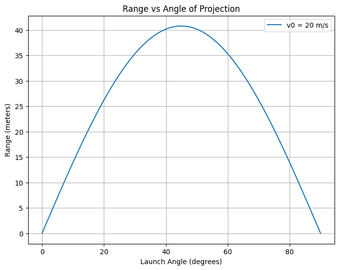

# Problem 1
# Problem 1: Investigating the Range as a Function of the Angle of Projection

## 1. Theoretical Foundation

Projectile motion follows the principles of Newtonian mechanics, and its behavior can be described using the equations of motion under constant acceleration. When a projectile is launched with an initial velocity $v_0$ at an angle $\theta$, the horizontal and vertical components of the velocity can be described as:

- Horizontal velocity: $v_{0x} = v_0 \cos(\theta)$
- Vertical velocity: $v_{0y} = v_0 \sin(\theta)$

The equations governing the projectile's motion are derived from the kinematic equations:

- Horizontal motion:  
  $x(t) = v_{0x} t = v_0 \cos(\theta) t$  
  where $x(t)$ is the horizontal position of the projectile at time $t$.

- Vertical motion:  
  $y(t) = v_{0y} t - \frac{1}{2} g t^2 = v_0 \sin(\theta) t - \frac{1}{2} g t^2$  
  where $y(t)$ is the vertical position of the projectile at time $t$, and $g$ is the acceleration due to gravity.

To find the time of flight and range, we focus on the conditions when the projectile reaches the ground again, i.e., when $y(t) = 0$. Solving for $t$ when $y(t) = 0$:

$$
0 = v_0 \sin(\theta) t - \frac{1}{2} g t^2
$$

This gives two solutions: $t = 0$ (the initial time) and the nontrivial solution $t = \frac{2 v_0 \sin(\theta)}{g}$, which is the time of flight.

Now, using this time in the horizontal motion equation:

$$
x(t) = v_0 \cos(\theta) \left( \frac{2 v_0 \sin(\theta)}{g} \right)
$$

Thus, the range $R(\theta)$ of the projectile is:

$$
R(\theta) = \frac{v_0^2 \sin(2\theta)}{g}
$$

This is the range $R(\theta)$ of the projectile, which depends on the initial velocity $v_0$, gravitational acceleration $g$, and the launch angle $\theta$.

## 2. Analysis of the Range

The equation for the range is:

$$
R(\theta) = \frac{v_0^2 \sin(2\theta)}{g}
$$

Key observations:
- **Maximum Range:** The range is maximized when $\sin(2\theta)$ is maximized, which occurs when $\theta = 45^\circ$. This is because the sine function reaches its maximum value of 1 when $2\theta = 90^\circ$, or $\theta = 45^\circ$.
- **Effect of Initial Velocity:** A higher initial velocity $v_0$ leads to a larger range since the range is proportional to the square of the velocity.
- **Effect of Gravitational Acceleration:** A higher gravitational acceleration $g$ reduces the range, as the range is inversely proportional to $g$.

Thus, the relationship between the angle of projection and the range is sinusoidal, peaking at 45°, and the range increases with greater initial velocities and decreases with stronger gravitational fields.

## 3. Practical Applications

In real-world scenarios, such as sports or engineering, projectiles are often affected by air resistance, which is not accounted for in the idealized model. Air resistance introduces a drag force that depends on the velocity of the object, and as the projectile's speed increases, the drag force grows, affecting both the horizontal and vertical motions.

In the presence of air resistance, the equations become more complex, and numerical methods (such as solving differential equations numerically) are often required. This model can also be adjusted for projectiles launched from uneven terrain by considering the launch height and adjusting the vertical motion equation.

## 4. Implementation (Python Script)

The task can be implemented using Python with the help of libraries like `matplotlib` for plotting and `numpy` for numerical calculations. Below is an outline of how to implement the simulation:

```python
import numpy as np
import matplotlib.pyplot as plt

def calculate_range(v0, theta, g=9.81):
    # Convert angle to radians
    theta_rad = np.radians(theta)
    
    # Calculate range based on the formula
    R = (v0 ** 2 * np.sin(2 * theta_rad)) / g
    return R

def plot_range_vs_angle(v0, g=9.81):
    # Create an array of angles from 0 to 90 degrees
    angles = np.linspace(0, 90, 100)
    
    # Calculate the range for each angle
    ranges = [calculate_range(v0, angle, g) for angle in angles]
    
    # Plot the range vs angle
    plt.figure(figsize=(8, 6))
    plt.plot(angles, ranges, label=f'v0 = {v0} m/s')
    plt.title('Range vs Angle of Projection')
    plt.xlabel('Launch Angle (degrees)')
    plt.ylabel('Range (meters)')
    plt.grid(True)
    plt.legend()
    plt.show()

# Example usage:
v0 = 20  # Initial velocity in m/s
plot_range_vs_angle(v0)

```


