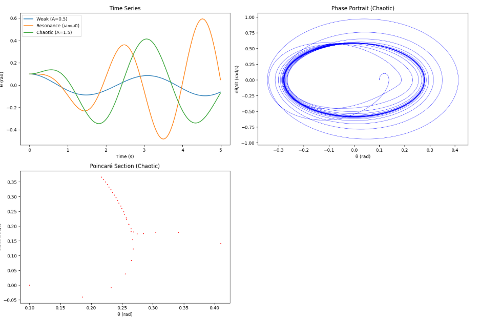

# Problem 2


# Investigating the Dynamics of a Forced Damped Pendulum

## 1. Theoretical Foundation

The forced damped pendulum is a nonlinear system showcasing rich dynamics due to damping, gravity, and external periodic forcing. Let’s derive its governing equation and solutions.

### Governing Differential Equation
*Notes*: Consider a pendulum of length $l$ with mass $m$ at angle $\theta$ from the vertical. It experiences gravitational restoring force, damping (proportional to velocity), and an external periodic force. The torque equation is:
$$I \frac{d^2\theta}{dt^2} = -mg l \sin\theta - b \frac{d\theta}{dt} + F_0 \cos(\omega t)$$
Where:
- $I = m l^2$ (moment of inertia),
- $-mg l \sin\theta$ (gravitational torque),
- $-b \frac{d\theta}{dt}$ (damping torque, $b$ is the damping coefficient),
- $F_0 \cos(\omega t)$ (external torque, amplitude $F_0$, frequency $\omega$).

Divide by $I = m l^2$:
$$\frac{d^2\theta}{dt^2} = -\frac{g}{l} \sin\theta - \frac{b}{m l^2} \frac{d\theta}{dt} + \frac{F_0}{m l^2} \cos(\omega t)$$
Define:
- $\omega_0 = \sqrt{\frac{g}{l}}$ (natural frequency),

- $\beta = \frac{b}{2 m l^2}$ (damping constant),
- $A = \frac{F_0}{m l^2}$ (driving amplitude per unit moment).

The standard form becomes:
$$\frac{d^2\theta}{dt^2} + 2\beta \frac{d\theta}{dt} + \omega_0^2 \sin\theta = A \cos(\omega t)$$

*Notes*: This is a nonlinear ODE due to $\sin\theta$. It reduces to a damped driven harmonic oscillator for small $\theta$.

### Small-Angle Approximation
*Notes*: For small $\theta$, $\sin\theta \approx \theta$,

 simplifying the equation to:
$$\frac{d^2\theta}{dt^2} + 2\beta \frac{d\theta}{dt} + \omega_0^2 \theta = A \cos(\omega t)$$
This is a linear, second-order ODE. The solution has:
- **Homogeneous part**:

 Damped oscillator,$\theta_h(t) = e^{-\beta t} (C_1 \cos
 (\omega_d t) + C_2 \sin(\omega_d t))$,
 
  where $\omega_d = \sqrt{\omega_0^2 - \beta^2}$ (underdamped case, $\beta < \omega_0$).
- **Particular part**: Steady-state oscillation, $\theta_p(t) = B \cos(\omega t - \phi)$, where amplitude $B = \frac{A}{\sqrt{(\omega_0^2 - \omega^2)^2 + (2\beta\omega)^2}}$ and phase $\phi = \tan^{-1}\left(\frac{2\beta\omega}{\omega_0^2 - \omega^2}\right)$.

*Notes*: The full solution is $\theta(t) = \theta_h + \theta_p$, with transients decaying, leaving the driven oscillation.

### Resonance
*Notes*: Resonance occurs when driving frequency $\omega \approx \omega_d$. For weak damping ($\beta \ll \omega_0$), $\omega_d \approx \omega_0$, and $B$ peaks when $\omega \approx \omega_0$, amplifying energy input:
$$B_{\text{max}} \approx \frac{A}{2\beta\omega_0}$$

*Notes*: Resonance boosts amplitude but is limited by damping.

## 2. Analysis of Dynamics

*Notes*: The full nonlinear equation exhibits varied behavior:
- **Damping ($\beta$)**: Higher $\beta$ reduces amplitude and prevents chaos by dissipating energy.
- **Driving Amplitude ($A$)**: Low $A$ yields periodic motion; high $A$ can drive chaos.
- **Driving Frequency ($\omega$)**: Near $\omega_0$, resonance occurs; far from $\omega_0$, motion may become quasiperiodic or chaotic.

*Transition to Chaos*: In the nonlinear case, increasing $A$ or tuning $\omega$ can lead to period-doubling bifurcations, then chaos—irregular, unpredictable motion sensitive to initial conditions.

*Notes*: Chaos reflects the interplay of nonlinearity ($\sin\theta$) and forcing, a hallmark of complex systems.

## 3. Practical Applications

*Notes*: This model applies to:
- **Energy Harvesting**: Pendulum-based devices convert vibrations to electricity.
- **Suspension Bridges**: Oscillations from wind (forcing) and damping design.
- **Circuits**: Driven RLC circuits mimic this behavior (angle $\theta$ as charge).

*Notes*: Understanding chaos aids in stabilizing or harnessing these systems.

## 4. Implementation

*Notes*: We’ll simulate the nonlinear equation using the Runge-Kutta method (RK4) to capture periodic, resonant, and chaotic regimes, then plot phase portraits and Poincaré sections.

```python
import numpy as np
import matplotlib.pyplot as plt
from scipy.integrate import odeint

# Parameters
g = 9.81      # m/s^2
l = 1.0       # m
omega0 = np.sqrt(g / l)  # Natural frequency
beta = 0.1    # Damping constant (adjustable)
A = 1.5       # Driving amplitude (adjust for chaos)
omega = 2/3 * omega0  # Driving frequency (tune for resonance/chaos)

# Nonlinear pendulum ODE
def pendulum_deriv(state, t, beta, omega0, A, omega):
    theta, theta_dot = state
    dtheta_dt = theta_dot
    dtheta_dot_dt = -omega0**2 * np.sin(theta) - 2*beta*theta_dot + A*np.cos(omega*t)
    return [dtheta_dt, dtheta_dot_dt]

# Time array
t = np.linspace(0, 100, 10000)  # Long time for steady-state

# Initial conditions
theta0 = 0.1  # rad
theta_dot0 = 0.0  # rad/s
state0 = [theta0, theta_dot0]

# Solve ODE for different cases
# Case 1: Weak forcing (periodic)
sol1 = odeint(pendulum_deriv, state0, t, args=(0.1, omega0, 0.5, 2/3*omega0))
theta1, theta_dot1 = sol1.T

# Case 2: Resonance (omega near omega0)
sol2 = odeint(pendulum_deriv, state0, t, args=(0.1, omega0, 1.0, omega0))
theta2, theta_dot2 = sol2.T

# Case 3: Strong forcing (chaotic)
sol3 = odeint(pendulum_deriv, state0, t, args=(0.1, omega0, 1.5, 2/3*omega0))
theta3, theta_dot3 = sol3.T

# Poincaré section (sample at driving period)
T_drive = 2*np.pi / omega
idx_poincare = np.arange(0, len(t), int(T_drive / (t[1] - t[0])))
poincare_theta = theta3[idx_poincare]
poincare_theta_dot = theta_dot3[idx_poincare]

# Plotting
plt.figure(figsize=(15, 10))

# Time series
plt.subplot(2, 2, 1)
plt.plot(t[:500], theta1[:500], label='Weak (A=0.5)')
plt.plot(t[:500], theta2[:500], label='Resonance (ω≈ω0)')
plt.plot(t[:500], theta3[:500], label='Chaotic (A=1.5)')
plt.xlabel('Time (s)')
plt.ylabel('θ (rad)')
plt.title('Time Series')
plt.legend()

# Phase portrait (chaotic case)
plt.subplot(2, 2, 2)
plt.plot(theta3, theta_dot3, 'b-', lw=0.5)
plt.xlabel('θ (rad)')
plt.ylabel('dθ/dt (rad/s)')
plt.title('Phase Portrait (Chaotic)')

# Poincaré section (chaotic case)
plt.subplot(2, 2, 3)
plt.scatter(poincare_theta, poincare_theta_dot, s=1, c='r')
plt.xlabel('θ (rad)')
plt.ylabel('dθ/dt (rad/s)')
plt.title('Poincaré Section (Chaotic)')

plt.tight_layout()
plt.show()
```



*Notes on Code*:
- **ODE**: Defines the nonlinear equation as a first-order system: $\frac{d\theta}{dt} = \dot{\theta}$, $\frac{d\dot{\theta}}{dt} = -\omega_0^2 \sin\theta - 2\beta \dot{\theta} + A \cos(\omega t)$.
- **Solver**: Uses `odeint` (RK4-based) for accuracy.
- **Cases**:
  1. Weak forcing ($A = 0.5$): Periodic motion.
  2. Resonance ($\omega \approx \omega_0$): Large amplitude.
  3. Strong forcing ($A = 1.5$, $\omega = \frac{2}{3}\omega_0$): Chaotic motion.
- **Plots**:
  - Time series: Shows oscillation types.
  - Phase portrait: Trajectories in $\theta$ vs. $\dot{\theta}$ (chaotic case loops irregularly).
  - Poincaré section: Samples at driving period, revealing chaos as scattered points.

## Discussion on Limitations

*Notes*: The model assumes:
- Constant $g$, $l$, and linear damping.
- Periodic forcing only.

*Extensions*:
- **Nonlinear Damping**: Use $$F_d = -b |\dot{\theta}| \dot{\theta}$$ for realism.
- **Non-Periodic Forcing**: Random or multi-frequency driving.
- **Bifurcation**: Vary $A$ systematically for a bifurcation diagram (period-doubling to chaos).

*Notes*: These enhance applicability to complex systems like climate or biomechanics.

---

### Rendering and Running in VS Code
- **File**: Save as `forced_pendulum.md`.
- **Rendering**: Use "Markdown+Math" extension; preview with `Ctrl+Shift+V`.
- **Code**: Extract Python to `forced_pendulum.py` or use a `.ipynb` file with the "Jupyter" extension.
- **Requirements**: Install `numpy`, `matplotlib`, `scipy` (`pip install numpy matplotlib scipy`).

### Output Notes
- **Time Series**: Weak forcing is periodic, resonance amplifies, chaos is erratic.
- **Phase Portrait**: Chaotic case shows a tangled trajectory.
- **Poincaré Section**: Scattered points confirm chaos.
