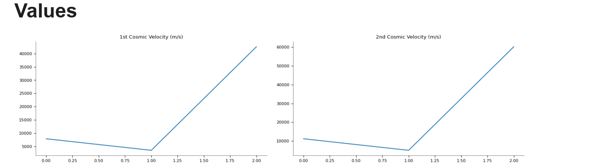

# Problem 2: Escape Velocities and Cosmic Velocities

The concept of **escape velocity** is essential in understanding how a spacecraft can break free from a planet’s gravitational pull. This leads us to the definitions of:

- **First Cosmic Velocity**: the minimum speed needed to enter a stable orbit around a planet.
- **Second Cosmic Velocity**: the speed required to escape the gravitational pull of a planet entirely.
- **Third Cosmic Velocity**: the speed needed to leave the gravitational influence of the entire solar system.

These concepts are foundational for launching satellites, sending missions to other planets, and envisioning potential interstellar travel.

---

The **first cosmic velocity** is given by:

$$
v_1 = \sqrt{\frac{GM}{R}}
$$

The **second cosmic velocity** is:

$$
v_2 = \sqrt{2} \cdot v_1 = \sqrt{\frac{2GM}{R}}
$$

The **third cosmic velocity**, required to leave the solar system from Earth, is estimated by:

$$
v_3 = \sqrt{v_{\text{esc, Earth}}^2 + v_{\text{orbital, Earth}}^2}
$$

Where:

- \( G = 6.674 \times 10^{-11} \, \text{m}^3 \cdot \text{kg}^{-1} \cdot \text{s}^{-2} \) is the gravitational constant  
- \( M \) is the mass of the planet  
- \( R \) is the radius of the planet  

---

```python
import numpy as np
import matplotlib.pyplot as plt
import pandas as pd

# Constants
G = 6.67430e-11  # gravitational constant in m^3 kg^-1 s^-2

# Celestial body data: radius in meters, mass in kg
bodies = {
    "Earth": {"R": 6.371e6, "M": 5.972e24},
    "Mars": {"R": 3.3895e6, "M": 6.4171e23},
    "Jupiter": {"R": 6.9911e7, "M": 1.898e27}
}

# Function to compute velocities
def compute_cosmic_velocities(R, M):
    v1 = np.sqrt(G * M / R)       # first cosmic velocity
    v2 = np.sqrt(2 * G * M / R)   # second cosmic velocity
    return v1, v2

# Calculate velocities
results = []
for body, data in bodies.items():
    v1, v2 = compute_cosmic_velocities(data["R"], data["M"])
    results.append({
        "Body": body,
        "1st Cosmic Velocity (m/s)": v1,
        "2nd Cosmic Velocity (m/s)": v2
    })

df = pd.DataFrame(results)
df
```




import numpy as np
import matplotlib.pyplot as plt

