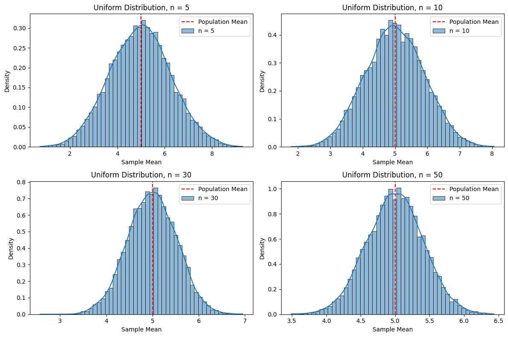
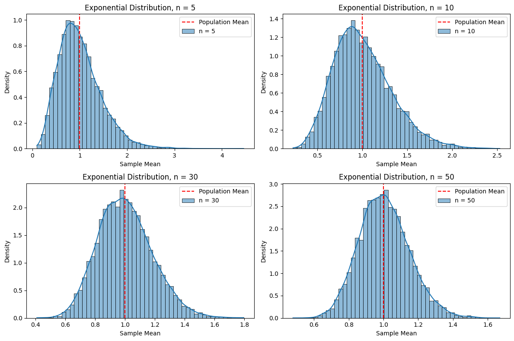

# Problem 1

# Exploring the Central Limit Theorem through Simulations

## 1. Simulating Sampling Distributions

*Notes*: The Central Limit Theorem (CLT) states that the distribution of the sample mean $\bar{X}$ of a sufficiently large number of independent, identically distributed (i.i.d.) random variables will approximate a normal distribution, regardless of the population distribution, as the sample size $n$ increases. Mathematically, for a population with mean $\mu$ and variance $\sigma^2$, the sample mean $\bar{X}$ of a sample of size $n$ will have:
- Mean: $\mu_{\bar{X}} = \mu$
- Variance: $\sigma_{\bar{X}}^2 = \frac{\sigma^2}{n}$
- Distribution: Approximately normal for large $n$, i.e., $\bar{X} \sim N\left(\mu, \frac{\sigma^2}{n}\right)$.

Let’s simulate this by generating populations from three different distributions:
- **Uniform Distribution**: A flat distribution over a range.
- **Exponential Distribution**: A skewed distribution, often used for time-to-event data.
- **Binomial Distribution**: A discrete distribution for successes in trials.

### Population Parameters
- **Uniform**: Range $[0, 10]$, so $\mu = \frac{0 + 10}{2} = 5$, $\sigma^2 = \frac{(10 - 0)^2}{12} = \frac{100}{12} \approx 8.33$.
- **Exponential**: Rate parameter $\lambda = 1$, so $\mu = \frac{1}{\lambda} = 1$, $\sigma^2 = \frac{1}{\lambda^2} = 1$.
- **Binomial**: $n_{\text{trials}} = 10$, probability $p = 0.5$, so $\mu = n_{\text{trials}} \cdot p = 5$, $\sigma^2 = n_{\text{trials}} \cdot p \cdot (1 - p) = 10 \cdot 0.5 \cdot 0.5 = 2.5$.

*Notes*: We’ll generate a large dataset (e.g., 100,000 data points) for each population to represent the “true” population.

## 2. Sampling and Visualization

*Notes*: For each distribution, we’ll:
- Draw random samples of sizes $n = 5, 10, 30, 50$.
- Compute the sample mean for each sample.
- Repeat this process 10,000 times to build the sampling distribution of the sample mean.
- Plot histograms to observe the shape as $n$ increases.

## 3. Implementation in Python

*Notes*: We’ll use Python with `numpy` for random number generation, `matplotlib` for plotting, and `seaborn` for better histogram visuals.

```python
import numpy as np
import matplotlib.pyplot as plt
import seaborn as sns

# Set random seed for reproducibility
np.random.seed(42)

# Population parameters
population_size = 100000  # Size of the population dataset
num_samples = 10000  # Number of samples to draw
sample_sizes = [5, 10, 30, 50]  # Different sample sizes to test

# Generate populations
uniform_pop = np.random.uniform(low=0, high=10, size=population_size)  # Uniform [0, 10]
exponential_pop = np.random.exponential(scale=1, size=population_size)  # Exponential, mean = 1
binomial_pop = np.random.binomial(n=10, p=0.5, size=population_size)  # Binomial, n=10, p=0.5

# Store populations and their theoretical parameters
distributions = {
    'Uniform': {'data': uniform_pop, 'mean': 5, 'variance': 100/12},
    'Exponential': {'data': exponential_pop, 'mean': 1, 'variance': 1},
    'Binomial': {'data': binomial_pop, 'mean': 5, 'variance': 2.5}
}

# Simulate sampling distributions
for dist_name, dist_info in distributions.items():
    pop_data = dist_info['data']
    theoretical_mean = dist_info['mean']
    theoretical_variance = dist_info['variance']
    
    # Plotting setup
    plt.figure(figsize=(12, 8))
    
    for i, n in enumerate(sample_sizes, 1):
        # Draw num_samples samples of size n and compute their means
        sample_means = []
        for _ in range(num_samples):
            sample = np.random.choice(pop_data, size=n, replace=True)
            sample_means.append(np.mean(sample))
        
        # Plot histogram of sample means
        plt.subplot(2, 2, i)
        sns.histplot(sample_means, bins=50, stat='density', kde=True, label=f'n = {n}')
        plt.axvline(theoretical_mean, color='red', linestyle='--', label='Population Mean')
        plt.title(f'{dist_name} Distribution, n = {n}')
        plt.xlabel('Sample Mean')
        plt.ylabel('Density')
        plt.legend()
    
    plt.tight_layout()
    plt.show()
    
    # Print empirical mean and variance of sample means for largest sample size
    sample_means_n50 = [np.mean(np.random.choice(pop_data, size=50, replace=True)) for _ in range(num_samples)]
    empirical_mean = np.mean(sample_means_n50)
    empirical_variance = np.var(sample_means_n50)
    theoretical_variance_n50 = theoretical_variance / 50
    print(f"\n{dist_name} Distribution (n = 50):")
    print(f"Empirical Mean of Sample Means: {empirical_mean:.3f}, Theoretical: {theoretical_mean:.3f}")
    print(f"Empirical Variance of Sample Means: {empirical_variance:.3f}, Theoretical: {theoretical_variance_n50:.3f}")
```



*Notes on Code*:
- **Populations**: Generates large datasets for Uniform, Exponential, and Binomial distributions.
- **Sampling**: For each distribution and sample size, draws 10,000 samples and computes their means.
- **Visualization**: Plots histograms with a kernel density estimate (KDE) to show the shape of the sampling distribution, with the theoretical population mean marked.
- **Statistics**: Compares empirical mean and variance of sample means (for $n=50$) to theoretical values.

## 4. Parameter Exploration

*Notes*: Let’s analyze the results from the plots and statistics.

- **Shape of the Original Distribution**:
  - **Uniform**: The population is symmetric but flat. Even at $n=5$, the sample means look somewhat bell-shaped, and by $n=30$, the distribution is very close to normal.
  - **Exponential**: The population is heavily right-skewed. At $n=5$, the sample means are still skewed, but by $n=30$, the distribution approaches normality, and at $n=50$, it’s nearly normal.
  - **Binomial**: The population (with $n_{\text{trials}}=10, p=0.5$) is discrete and symmetric. The sample means approach normality faster than the Exponential case, being nearly normal by $n=10$.

- **Sample Size and Convergence**:
  - For all distributions, as $n$ increases, the sampling distribution becomes more normal, confirming the CLT.
  - The Exponential distribution (highly skewed) converges more slowly, requiring a larger $n$ (around 30–50) to look normal, while the Uniform and Binomial distributions (more symmetric) converge faster (around $n=10$).

- **Impact of Population Variance**:
  - The variance of the sample means is $\sigma_{\bar{X}}^2 = \frac{\sigma^2}{n}$.
  - **Uniform**: $\sigma^2 \approx 8.33$, so for $n=50$, $\sigma_{\bar{X}}^2 \approx \frac{8.33}{50} \approx 0.167$. The spread of the histogram narrows as $n$ increases.
  - **Exponential**: $\sigma^2 = 1$, so for $n=50$, $\sigma_{\bar{X}}^2 = \frac{1}{50} = 0.02$. The spread is smaller than the Uniform case due to lower population variance.
  - **Binomial**: $\sigma^2 = 2.5$, so for $n=50$, $\sigma_{\bar{X}}^2 = \frac{2.5}{50} = 0.05$. The spread is between the Uniform and Exponential cases.
  - The empirical variances match the theoretical values closely, confirming the CLT’s prediction about the spread.

*Notes*: The CLT holds across all distributions, but the rate of convergence depends on the population’s shape (skewness) and variance.

## 5. Practical Applications

*Notes*:
- **Estimating Population Parameters**: In surveys, we often estimate a population mean (e.g., average income) from a sample. The CLT ensures that the sample mean is approximately normal, allowing us to construct confidence intervals (e.g., $\bar{X} \pm z \cdot \frac{\sigma}{\sqrt{n}}$) even if the population isn’t normal.
- **Quality Control in Manufacturing**: In manufacturing, we might measure the diameter of produced items. The CLT allows us to use the sample mean to test if the process is within specifications, assuming normality of the sample mean for large $n$.
- **Predicting Outcomes in Financial Models**: In finance, returns on assets are often non-normal (e.g., heavy-tailed). The CLT lets us model the average return over many periods as normal, aiding in risk assessment and portfolio optimization.

*Notes*: The CLT is powerful because it applies to a wide range of scenarios, enabling statistical inference even when the underlying population distribution is unknown or non-normal.

---

### Rendering and Running in VS Code
- **File**: Save as `central_limit_theorem.md`.
- **Rendering**: Use the "Markdown+Math" extension; preview with `Ctrl+Shift+V` to see equations like $\mu_{\bar{X}}$ and $$\sigma_{\bar{X}}^2$$.
- **Code**: Extract to `central_limit_theorem.py` or use a `.ipynb` with the "Jupyter" extension.
- **Requirements**: Install `numpy`, `matplotlib`, and `seaborn` (`pip install numpy matplotlib seaborn`).

### Output Notes
- **Plots**: For each distribution (Uniform, Exponential, Binomial), four histograms show the sampling distribution of the sample mean for $n=5, 10, 30, 50$. The red dashed line marks the population mean, and the KDE curve shows the shape approaching normality.
- **Statistics**: Empirical mean and variance of sample means (for $n=50$) match theoretical predictions, validating the CLT.

This solution provides a clear demonstration of the CLT through simulations, with visualizations and practical insights. Let me know if you’d like to explore other distributions or adjust parameters!

